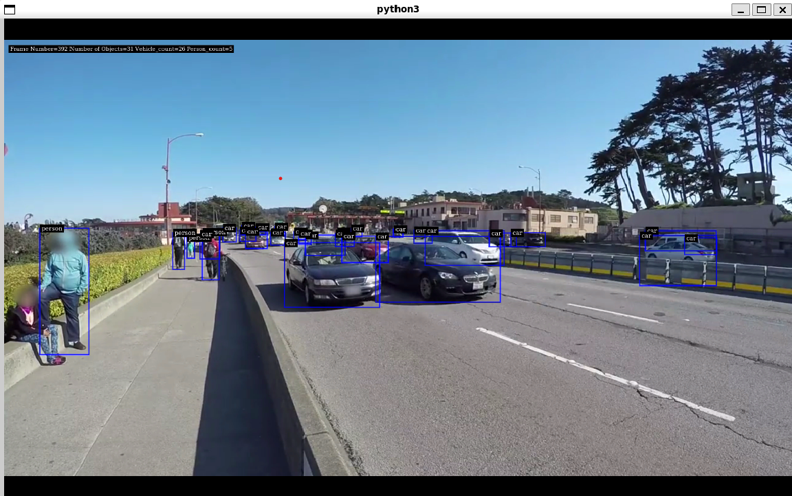

- [拉取deepstream\_python\_apps工程](#拉取deepstream_python_apps工程)
- [安装依赖文件](#安装依赖文件)
- [测试用例](#测试用例)
- [测试GST管道的方法](#测试gst管道的方法)


# 拉取deepstream_python_apps工程

Nvidia发布了一种可以使用Python开发Deepstream应用的套件，截止至当前支持的Deepstream版本是7.0. 目前已经发布至Github中，可以通过如下命令拉取该工具。

```sh
git clone https://github.com/NVIDIA-AI-IOT/deepstream_python_apps
```

如果要拉取一些较早的版本，比如支持Deepstream 6.4版本的代码，那么执行

```sh
git clone https://github.com/NVIDIA-AI-IOT/deepstream_python_apps -b v1.1.10
```

接下来的内容中，讨论的都是支持Deepstream 7.0版本的deepstream_python_apps，当前版本是`v1.1.11`。代码下载后需要放到Deepstream目录下，默认路径是`/opt/nvidia/deepstream/deepstream/sources/deepstream_python_apps`，如果使用的是docker镜像，那么可以通过挂载的方式，把该项目挂到docker镜像中。

```sh
docker run --gpus all -it --rm --net=host --privileged \
    -v /tmp/.X11-unix:/tmp/.X11-unix \
    -v /path/to/deepstream_python_apps:/opt/nvidia/deepstream/deepstream/sources/deepstream_python_apps \
    -e DISPLAY=$DISPLAY \
    -w /opt/nvidia/deepstream/deepstream \
    nvcr.io/nvidia/deepstream:7.0-samples-multiarch
```

但是在正式使用之前，还需要安装几个东西。

# 安装依赖文件

首先更新一遍缓存

```sh
sudo apt-get update
```

然后安装`pycairo`以及其所需的依赖文件

```sh
sudo apt-get install libcairo2-dev pkg-config python3-dev
```

接下来是`pgi`

```sh
sudo apt-get install libgirepository1.0-dev
```

然后从Github上下载`pyds`

```sh
wget https://github.com/NVIDIA-AI-IOT/deepstream_python_apps/releases/download/v1.1.11/pyds-1.1.11-py3-none-linux_x86_64.whl
```

然后通过PIP安装WHL文件。

```sh
pip3 install pyds-1.1.11-py3-none-linux_x86_64.whl
```

之后是`cuda-python`

```sh
pip3 install cuda-python
```

# 测试用例

为了验证是否成功，可以执行下述命令。

首先，cd到`/opt/nvidia/deepstream/deepstream/sources/deepstream_python_apps/apps/deepstream-test1`

然后，执行下述命令

```sh
python3 ./deepstream_test_1.py /opt/nvidia/deepstream/deepstream/samples/streams/sample_720p.h264
```

如果一切正常，应该可以看到推理出来的结果了。

<p align="center">  </p>


# 测试GST管道的方法

Nvidia的整个Deepstream都是构建在GST上进行二度开发的。因此，如果使用的Docker环境，有时候需要手工确认下GST是否工作正常。所以可以执行执行下述指令进行测试。

```sh
gst-launch-1.0 videotestsrc ! autovideosink
```

如果没问题，那么应该会看到下面类似的窗口。

<p align="center">  </p>
